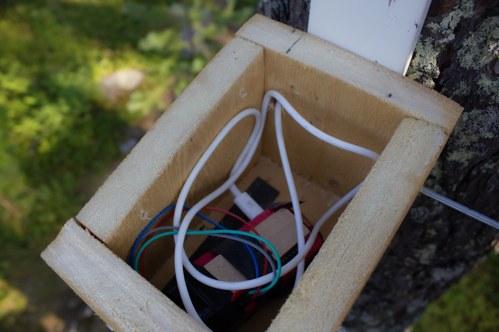
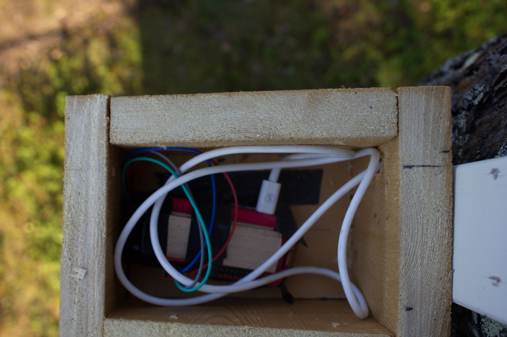
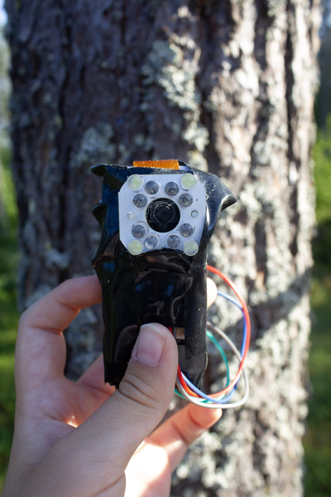
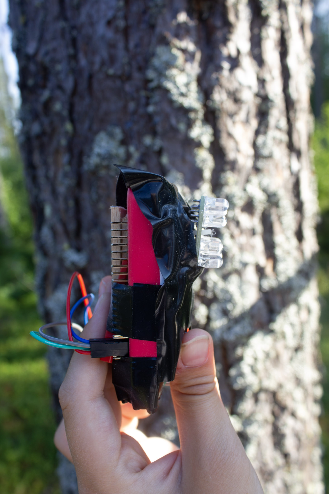
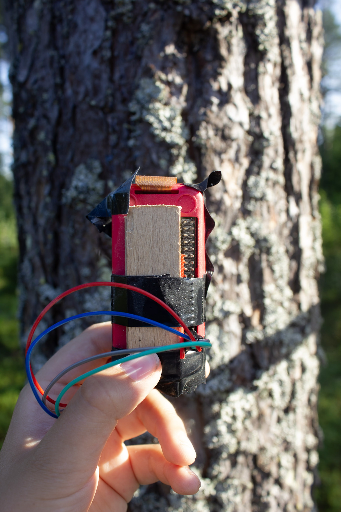
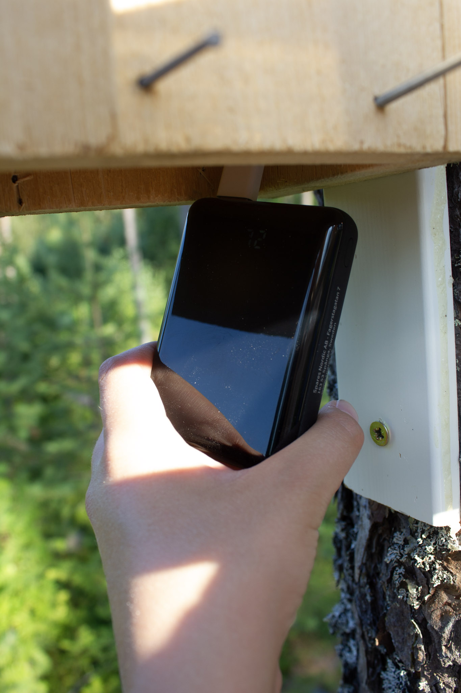
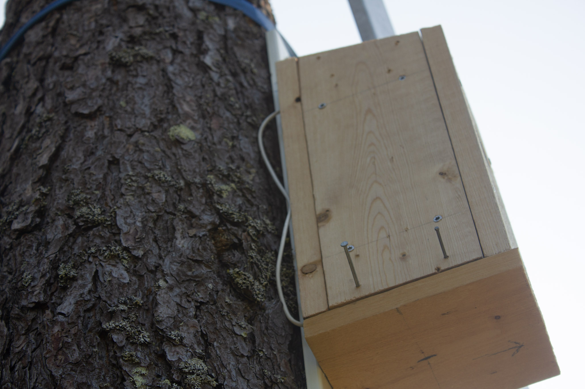

# Birdbox
Birdbox using RPI zero

As you can se we went with a Raspberry Pi Zero W with the NOIR camera and a brightpi.

 

## Let's look closer

 
 

Yes, This is a bodge. (What's a bodge? Click here= https://youtu.be/lIFE7h3m40U)

## How we got the power
We used a powerbank.

 
